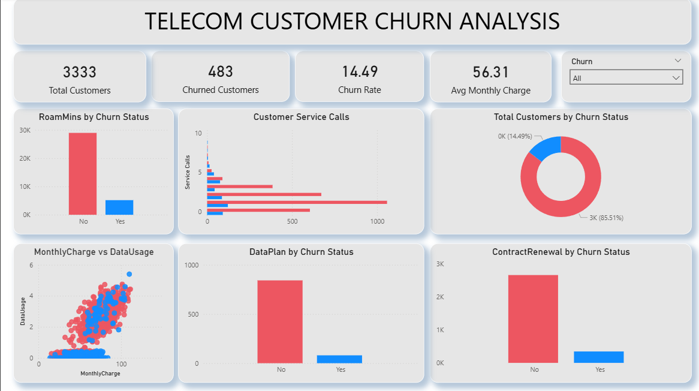

# Telecom Customer Churn Analysis

## Project Overview
Customer churn is a major challenge in the telecom industry. This project analyzes telecom customer behavior to identify patterns that lead to customer churn. The analysis is performed using Python for exploratory data analysis and Power BI for interactive dashboard visualization.

---

## Tools & Technologies
- Python
- Pandas
- NumPy
- SQL
- Matplotlib
- Seaborn
- Power BI
- Jupyter Notebook
  

---

## Dataset
The dataset contains telecom customer information including usage patterns, service plans, billing details, and churn status.

Key features include:

- AccountWeeks  
- Customer Service Calls  
- Data Usage  
- Monthly Charge  
- Data Plan  
- Contract Renewal  
- Roaming Minutes  
- Churn Status  

---

## Project Workflow
1. Data Cleaning and Preprocessing using Python  
2. Exploratory Data Analysis (EDA) to identify churn patterns  
3. Feature analysis such as customer service calls, contract renewal, and data usage  
4. Creation of an interactive Power BI dashboard to visualize business insights  

---

## Key Insights
- Customers with higher customer service calls are more likely to churn.
- Customers without contract renewal show significantly higher churn rates.
- Higher monthly charges are associated with increased churn risk.
- Customers without data plans tend to churn more frequently.

---

## Dashboard Preview


---

## Business Recommendations
- Improve customer support response and issue resolution.
- Encourage long-term contract renewals through loyalty incentives.
- Offer optimized pricing plans for heavy data users.
- Identify high-risk customers early and provide retention offers.

---

## Repository Structure
```
telecom-customer-churn-analysis
│
├── data
│   └── telecom_churn.csv
│
├── notebooks
│   └── churn_analysis.ipynb
│   └── churn_sql_analysis.ipynb
│
├── dashboard
│   └── churn_analysis_pi.pbix
│
├── dashboard_preview.png
│
└── README.md
```

---

## Conclusion
This project demonstrates an end-to-end data analysis workflow:

Data preprocessing → Exploratory data analysis → Insight generation → Interactive dashboard visualization.

The insights derived from this analysis can help telecom companies improve customer retention strategies and reduce churn.
